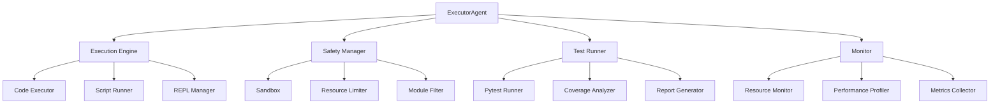

# ⚙️ Executor Agent - Safe Code Execution & Testing Engine

> **AI-Powered Code Execution System with Comprehensive Safety & Testing Features**  
> Execute code, run tests, and monitor resources with intelligent safety controls.

[](https://www.python.org/downloads/)
[](https://langchain-ai.github.io/langgraph/)
[](https://azure.microsoft.com/en-us/products/ai-services/openai-service)
[](#)

## 📋 Table of Contents

- [🎯 Overview](#-overview)
- [✨ Key Features](#-key-features)
- [🛠️ Available Tools](#️-available-tools)
- [🏗️ Architecture](#️-architecture)
- [🚀 Quick Start](#-quick-start)
- [💡 Usage Examples](#-usage-examples)
- [🔧 Configuration](#-configuration)
- [🛡️ Safety Features](#️-safety-features)
- [📊 Monitoring & Metrics](#-monitoring--metrics)
- [🤝 Integration](#-integration)
- [📚 API Reference](#-api-reference)

---

## 🎯 Overview

The **ExecutorAgent** is a specialized AI agent designed for safe code execution and comprehensive test running. It provides a secure environment for executing Python code, running test suites, and monitoring resource usage - all with intelligent safety controls and detailed reporting.

### 🔥 Why ExecutorAgent?

| **Feature** | **Description** |
|---|---|
| 🛡️ **Safe Execution** | Sandboxed environment with resource limits |
| 🧪 **Test Runner** | Execute pytest suites with coverage reports |
| 📊 **Resource Monitoring** | Track CPU, memory, and execution time |
| 🔍 **Dependency Analysis** | Analyze and install required packages |
| 📈 **Performance Profiling** | Profile code execution and identify bottlenecks |
| 🎯 **Smart Error Handling** | Intelligent error recovery and suggestions |

---

## ✨ Key Features

### 🛡️ **Secure Code Execution**
- **Sandboxed Environment**: Isolated execution with configurable restrictions
- **Resource Limits**: CPU, memory, and time limits to prevent abuse
- **Module Whitelisting**: Control which Python modules can be imported
- **Output Sanitization**: Clean and safe output handling

### 🧪 **Comprehensive Testing**
- **Pytest Integration**: Full pytest support with plugins
- **Coverage Analysis**: Detailed code coverage reports
- **Test Discovery**: Automatic test file detection
- **Fixture Support**: Handle complex test setups

### 📊 **Monitoring & Analysis**
- **Real-time Metrics**: CPU, memory, execution time tracking
- **Performance Profiling**: Identify bottlenecks and optimization opportunities
- **Dependency Tracking**: Analyze and manage package dependencies
- **Execution History**: Track and learn from past executions

### 🎯 **Intelligent Features**
- **Error Recovery**: Smart suggestions for fixing errors
- **Code Analysis**: Pre-execution validation and optimization
- **Batch Execution**: Run multiple code snippets efficiently
- **Session Management**: Maintain context across executions

---

## 🛠️ Available Tools

### 1️⃣ **Core Execution Tools**
- `execute_code` - Execute Python code with safety controls and resource monitoring
- `run_tests` - Run pytest test suites with coverage analysis
- `validate_code` - Validate code syntax and check for potential issues
- `handle_error` - Intelligent error handling with fix suggestions
- `create_demo` - Create demonstration code snippets

---

## 🏗️ Architecture



### 🏛️ **Core Components**

#### 1. **Execution Engine**
Handles all code execution with safety measures:
- Sandboxed execution environment
- Resource limitation enforcement
- Output capture and sanitization

#### 2. **Safety Manager**
Ensures secure execution:
- Pre-execution code analysis
- Module and function whitelisting
- Resource usage monitoring
- Timeout enforcement

#### 3. **Test Runner**
Comprehensive test execution:
- Pytest integration
- Coverage measurement
- Fixture handling
- Parallel test execution

#### 4. **Monitor**
Real-time monitoring and analysis:
- Resource usage tracking
- Performance profiling
- Execution metrics collection

---

## 🚀 Quick Start

### 1. **Installation**

```bash
# Clone the repository
git clone <repository-url>
cd workspace

# Install dependencies
pip install -r requirements.txt
```

### 2. **Basic Setup**

```python
from agent.executor import ExecutorAgent

# Create an Executor Agent
executor = ExecutorAgent()

# Execute simple code
result = executor.chat("""
Execute this code:
```python
def fibonacci(n):
    if n <= 1:
        return n
    return fibonacci(n-1) + fibonacci(n-2)

print([fibonacci(i) for i in range(10)])
```
""")

print(result)
```

### 3. **Run Tests**

```python
# Run pytest on a test file
result = executor.chat("""
Run the tests in test_calculator.py and show me the coverage report
""")
```

---

## 💡 Usage Examples

### 🎯 **Example 1: Safe Code Execution**

```python
from agent.executor import ExecutorAgent

executor = ExecutorAgent()

# Execute code with automatic safety checks
response = executor.chat("""
Execute this data processing code:

```python
import pandas as pd
import numpy as np

# Generate sample data
data = pd.DataFrame({
    'values': np.random.randn(1000),
    'categories': np.random.choice(['A', 'B', 'C'], 1000)
})

# Analyze data
summary = data.groupby('categories')['values'].agg(['mean', 'std', 'count'])
print("Data Summary:")
print(summary)

# Plot if matplotlib is available
try:
    import matplotlib.pyplot as plt
    data['values'].hist(bins=30)
    plt.title('Value Distribution')
    plt.show()
except ImportError:
    print("Matplotlib not available for plotting")
```
""")

print("✅ Execution completed safely!")
```

### 🧪 **Example 2: Comprehensive Test Running**

```python
# Run tests with coverage analysis
response = executor.chat("""
I have a module called 'calculator.py' with basic math functions.
Run comprehensive tests on it and give me a coverage report.
Also identify any untested code paths.
""")

# The executor will:
# 1. Locate test files
# 2. Run pytest with coverage
# 3. Generate detailed reports
# 4. Suggest additional tests for uncovered code
```

### 📊 **Example 3: Performance Profiling**

```python
# Profile code performance
response = executor.chat("""
Profile this sorting algorithm and identify performance bottlenecks:

```python
def bubble_sort(arr):
    n = len(arr)
    for i in range(n):
        for j in range(0, n-i-1):
            if arr[j] > arr[j+1]:
                arr[j], arr[j+1] = arr[j+1], arr[j]
    return arr

# Test with different sizes
import time
sizes = [100, 500, 1000, 2000]
for size in sizes:
    arr = list(range(size, 0, -1))
    start = time.time()
    bubble_sort(arr.copy())
    end = time.time()
    print(f"Size {size}: {end-start:.4f} seconds")
```

Profile this and suggest optimizations.
""")
```

### 🔍 **Example 4: Dependency Analysis**

```python
# Analyze and install dependencies
response = executor.chat("""
Analyze the dependencies in this code and set up the environment:

```python
import pandas as pd
import numpy as np
from sklearn.model_selection import train_test_split
from sklearn.ensemble import RandomForestClassifier
import seaborn as sns
import matplotlib.pyplot as plt

# Your ML code here...
```

Check which packages are missing and install them safely.
""")
```

### 🚀 **Example 5: Batch Script Execution**

```python
# Execute multiple scripts in sequence
response = executor.chat("""
Execute these scripts in order and aggregate the results:

1. data_preparation.py - Prepares the dataset
2. model_training.py - Trains the ML model
3. evaluation.py - Evaluates model performance

Show me the output of each step and any errors encountered.
""")
```

---

## 🔧 Configuration

### ⚙️ **ExecutorConfig Class**

```python
class ExecutorConfig:
    # Execution Settings
    TIMEOUT = 30  # Maximum execution time in seconds
    MAX_MEMORY = "512MB"  # Maximum memory usage
    MAX_OUTPUT_LENGTH = 10000  # Maximum output characters
    
    # Safety Settings
    SANDBOX_MODE = True  # Enable sandboxing
    ALLOWED_MODULES = [
        'numpy', 'pandas', 'matplotlib', 
        'sklearn', 'requests', 'json'
    ]
    FORBIDDEN_FUNCTIONS = [
        'eval', 'exec', '__import__', 
        'open', 'compile'
    ]
    
    # Test Settings
    PYTEST_ARGS = ['-v', '--tb=short']
    COVERAGE_THRESHOLD = 80  # Minimum coverage percentage
    
    # Monitoring
    ENABLE_PROFILING = True
    COLLECT_METRICS = True
```

### 🔐 **Environment Variables**

```bash
# Execution limits
export EXECUTOR_TIMEOUT=30
export EXECUTOR_MAX_MEMORY="512MB"

# Safety settings
export EXECUTOR_SANDBOX_MODE=true
export EXECUTOR_ALLOWED_MODULES="numpy,pandas,matplotlib"

# Test configuration
export PYTEST_ARGS="-v --tb=short --cov"
export COVERAGE_THRESHOLD=80
```

---

## 🛡️ Safety Features

### 🔒 **Sandboxing**

The ExecutorAgent implements multiple layers of safety:

1. **Code Analysis**
   ```python
   # Pre-execution analysis
   - AST parsing for dangerous patterns
   - Import validation
   - Function call checking
   ```

2. **Resource Limits**
   ```python
   # Enforced limits
   - CPU time: 30 seconds default
   - Memory: 512MB default
   - Output size: 10KB default
   - File system: Read-only access
   ```

3. **Module Restrictions**
   ```python
   # Whitelisted modules only
   ALLOWED = ['numpy', 'pandas', 'matplotlib']
   # Blocked dangerous functions
   BLOCKED = ['eval', 'exec', 'open']
   ```

### 🚨 **Error Handling**

Comprehensive error management:

```python
# Execution errors
try:
    result = executor.execute_code(code)
except ExecutionTimeout:
    # Handle timeout
except MemoryLimitExceeded:
    # Handle memory issues
except SecurityViolation:
    # Handle security violations
```

---

## 📊 Monitoring & Metrics

### 📈 **Execution Metrics**

The agent collects detailed metrics:

```python
metrics = executor.get_last_execution_metrics()
print(f"Execution time: {metrics['execution_time']}s")
print(f"Memory used: {metrics['memory_used']}MB")
print(f"CPU usage: {metrics['cpu_percent']}%")
```

### 🔍 **Performance Profiling**

Built-in profiling capabilities:

```python
profile = executor.profile_code(code)
print("Top 10 time-consuming functions:")
for func in profile['top_functions'][:10]:
    print(f"{func['name']}: {func['time']}s ({func['percent']}%)")
```

---

## 🤝 Integration

### 🔗 **With CoderAgent**

```python
from agent.coder import CoderAgent
from agent.executor import ExecutorAgent

# Generate code
coder = CoderAgent()
code = coder.generate_agent(...)

# Execute and validate
executor = ExecutorAgent()
result = executor.chat(f"Execute and validate this code:\n{code}")
```

### 🧪 **With TesterAgent**

```python
from agent.tester import TesterAgent
from agent.executor import ExecutorAgent

# Generate tests
tester = TesterAgent()
tests = tester.generate_tests(...)

# Run tests
executor = ExecutorAgent()
results = executor.chat(f"Run these tests with coverage:\n{tests}")
```

---

## 📚 API Reference

### 🏗️ **ExecutorAgent**

#### Constructor
```python
ExecutorAgent(
    session_id: str = None,
    use_all_tools: bool = False,
    config: ExecutorConfig = None
)
```
- `session_id`: Unique session identifier
- `use_all_tools`: Enable all available tools
- `config`: Custom configuration

#### Methods

##### `execute_code()`
```python
def execute_code(
    code: str,
    timeout: int = 30,
    max_memory: str = "512MB",
    safe_mode: bool = True
) -> ExecutionResult
```

**Returns:**
```python
{
    "success": bool,
    "output": str,
    "error": str,
    "metrics": {
        "execution_time": float,
        "memory_used": float,
        "cpu_percent": float
    }
}
```

##### `run_tests()`
```python
def run_tests(
    test_path: str,
    coverage: bool = True,
    pytest_args: List[str] = None
) -> TestResult
```

##### `chat()`
```python
def chat(message: str) -> str
```
Interactive interface for code execution requests.

### 🛠️ **Available Tools Reference**

| Tool | Purpose | Key Features |
|------|---------|--------------|
| `execute_code` | Run Python code safely | Timeout control, output capture, error handling |
| `run_tests` | Execute pytest suites | Coverage reports, test discovery, fixture support |
| `validate_code` | Validate code syntax | AST parsing, import checking, syntax validation |
| `handle_error` | Smart error handling | Error analysis, fix suggestions, recovery options |
| `create_demo` | Generate demo code | Example creation, pattern demonstration |

---

## 🎯 Best Practices

### 💡 **Code Execution**

1. **Always Use Timeouts**
   ```python
   # Good - explicit timeout
   executor.execute_code(code, timeout=10)
   
   # Avoid - no timeout for unknown code
   executor.execute_code(untrusted_code)
   ```

2. **Monitor Resource Usage**
   ```python
   # Good - check metrics after execution
   result = executor.execute_code(code)
   if result['metrics']['memory_used'] > 100:
       print("Warning: High memory usage")
   ```

3. **Handle Errors Gracefully**
   ```python
   # Good - comprehensive error handling
   try:
       result = executor.execute_code(code)
   except Exception as e:
       print(f"Execution failed: {e}")
       # Get suggestions for fixes
       suggestions = executor.get_error_suggestions(e)
   ```

### 🧪 **Test Execution**

1. **Use Coverage Analysis**
   ```python
   # Good - always check coverage
   result = executor.run_tests("tests/", coverage=True)
   if result['coverage'] < 80:
       print("Coverage below threshold!")
   ```

2. **Organize Test Runs**
   ```python
   # Good - structured test execution
   test_suites = ['unit/', 'integration/', 'e2e/']
   for suite in test_suites:
       result = executor.run_tests(suite)
       print(f"{suite}: {result['passed']}/{result['total']}")
   ```

---

## 🚀 Advanced Features

### 🔄 **Session Management**

Maintain context across executions:

```python
# Create a session
executor = ExecutorAgent(session_id="data_analysis")

# First execution - import libraries
executor.chat("Import pandas and numpy")

# Second execution - use imported libraries
executor.chat("Create a DataFrame with random data")

# Session state is maintained
```

### 📦 **Batch Processing**

Execute multiple code blocks efficiently:

```python
code_blocks = [
    "import pandas as pd",
    "df = pd.DataFrame({'A': [1,2,3]})",
    "print(df.describe())"
]

results = executor.execute_batch(code_blocks)
for i, result in enumerate(results):
    print(f"Block {i+1}: {'✓' if result['success'] else '✗'}")
```

### 🎨 **Custom Execution Environments**

Create specialized environments:

```python
# Scientific computing environment
sci_config = ExecutorConfig()
sci_config.ALLOWED_MODULES = ['numpy', 'scipy', 'pandas', 'matplotlib']
sci_config.MAX_MEMORY = "2GB"

sci_executor = ExecutorAgent(config=sci_config)

# Web scraping environment
web_config = ExecutorConfig()
web_config.ALLOWED_MODULES = ['requests', 'beautifulsoup4', 'selenium']
web_config.TIMEOUT = 60  # Longer timeout for web requests

web_executor = ExecutorAgent(config=web_config)
```

---

## 🤝 Contributing

### 🛠️ **Adding New Execution Tools**

1. Create tool in `tools.py`:
   ```python
   def create_my_execution_tool(model):
       class MyExecutionTool(BaseTool):
           name = "my_execution_tool"
           description = "What this tool does"
           # Implementation
       return MyExecutionTool()
   ```

2. Add safety checks and monitoring
3. Update documentation

### 📝 **Development Guidelines**

- Always prioritize safety in execution
- Add comprehensive error handling
- Include resource monitoring
- Write tests for new features

---

## 📄 License

This project is part of the Core Agent framework. See the main repository for licensing information.

---

**⚙️ Ready to execute code safely and intelligently? Get started with the Quick Start guide above!**

*ExecutorAgent - Where Safety Meets Intelligent Code Execution* 🛡️