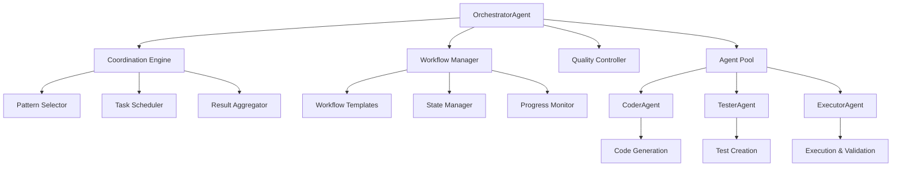

# 🎭 Orchestrator Agent - Intelligent Multi-Agent Coordination System

> **AI-Powered Orchestration for Seamless Agent Collaboration**  
> Coordinate CoderAgent, TesterAgent, and ExecutorAgent in perfect harmony for complete development workflows.

[](https://www.python.org/downloads/)
[](https://langchain-ai.github.io/langgraph/)
[](https://azure.microsoft.com/en-us/products/ai-services/openai-service)
[](#)
[](#)

## 📋 Table of Contents

- [🎯 Overview](#-overview)
- [✨ Key Features](#-key-features)
- [🎭 Coordination Patterns](#-coordination-patterns)
- [🛠️ Available Tools](#️-available-tools)
- [🏗️ Architecture](#️-architecture)
- [🚀 Quick Start](#-quick-start)
- [💡 Usage Examples](#-usage-examples)
- [🔧 Configuration](#-configuration)
- [📊 Workflow Templates](#-workflow-templates)
- [🎨 Best Practices](#-best-practices)
- [🤝 Integration](#-integration)
- [📚 API Reference](#-api-reference)

---

## 🎯 Overview

The **OrchestratorAgent** is a sophisticated AI orchestration system that coordinates multiple specialized agents to complete complex development workflows. It seamlessly manages the collaboration between CoderAgent (code generation), TesterAgent (test creation), and ExecutorAgent (code execution) to deliver production-ready solutions.

### 🔥 Why OrchestratorAgent?

| **Feature** | **Description** |
|---|---|
| 🎯 **Multi-Pattern Support** | Supervisor, Swarm, Pipeline, and Adaptive coordination |
| 🤖 **Agent Harmony** | Seamless coordination of Coder, Tester, and Executor agents |
| 📊 **Workflow Intelligence** | Auto-detects optimal workflow based on task requirements |
| 🔄 **Quality Control** | Built-in quality checks between workflow steps |
| 📈 **Progress Monitoring** | Real-time workflow tracking and reporting |
| 🚀 **Parallel Execution** | Swarm pattern for independent task parallelization |

---

## ✨ Key Features

### 🎭 **Intelligent Coordination**
- **Pattern Selection**: Automatically chooses the best coordination pattern
- **Task Delegation**: Smart assignment of tasks to appropriate agents
- **Context Preservation**: Maintains context across agent interactions
- **Error Recovery**: Automatic retry and fallback mechanisms

### 🔄 **Workflow Management**
- **Pre-built Templates**: Full development, code review, bug fix, optimization
- **Custom Workflows**: Define your own coordination patterns
- **Progress Tracking**: Monitor workflow state in real-time
- **Result Aggregation**: Intelligent merging of multi-agent outputs

### 📊 **Quality Assurance**
- **Step Validation**: Quality checks after each agent completes
- **Requirement Verification**: Ensures outputs meet original requirements
- **Test Integration**: Automatic testing at appropriate stages
- **Performance Monitoring**: Track execution time and resource usage

### 🚀 **Advanced Features**
- **Parallel Processing**: Swarm mode for concurrent tasks
- **Adaptive Patterns**: Dynamic pattern selection based on task
- **Direct Agent Access**: Bypass orchestration when needed
- **Session Management**: Persistent workflow state across interactions

---

## 🎭 Coordination Patterns

### 1️⃣ **Supervisor Pattern** (Default)
Sequential task delegation with quality control at each step.

```python
orchestrator = OrchestratorAgent(coordination_pattern="supervisor")
```

**Best for:**
- Complex workflows requiring step-by-step validation
- Tasks with dependencies between agents
- Production-critical code generation

**Flow:**
```
Plan → Coder → Quality Check → Tester → Quality Check → Executor → Final Review
```

### 2️⃣ **Swarm Pattern**
Parallel execution for independent tasks.

```python
orchestrator = OrchestratorAgent(coordination_pattern="swarm")
```

**Best for:**
- Multiple independent modules
- Parallel feature development
- Time-critical workflows

**Flow:**
```
        ┌→ Coder (Task 1) → Tester (Task 1) ┐
Plan → ├→ Coder (Task 2) → Tester (Task 2) ├→ Aggregate → Execute All
        └→ Coder (Task 3) → Tester (Task 3) ┘
```

### 3️⃣ **Pipeline Pattern**
Strict sequential processing without interruption.

```python
orchestrator = OrchestratorAgent(coordination_pattern="pipeline")
```

**Best for:**
- Predictable workflows
- Minimal coordination overhead
- Simple linear processes

**Flow:**
```
Coder → Tester → Executor → Done
```

### 4️⃣ **Adaptive Pattern**
Dynamic pattern selection based on task analysis.

```python
orchestrator = OrchestratorAgent(coordination_pattern="adaptive")
```

**Best for:**
- Mixed complexity tasks
- When optimal pattern is unclear
- Flexible requirements

**Flow:**
```
Analyze Task → Select Pattern → Execute with Chosen Pattern
```

---

## 🛠️ Available Tools

### 1️⃣ **Orchestration Tools**
- `plan_workflow` - Create execution plans for requests
- `delegate_task` - Assign tasks to specific agents
- `check_quality` - Validate agent outputs against requirements
- `aggregate_results` - Combine results from multiple agents

### 2️⃣ **Coordination Tools**
- `execute_parallel` - Manage parallel task execution (Swarm)
- `monitor_workflow` - Track workflow progress and status

---

## 🏗️ Architecture



### 🏛️ **Core Components**

#### 1. **Coordination Engine**
Manages agent interactions:
- Pattern implementation (Supervisor, Swarm, Pipeline, Adaptive)
- Task scheduling and delegation
- Result aggregation and synthesis

#### 2. **Workflow Manager**
Controls workflow execution:
- Template selection and customization
- State persistence and recovery
- Progress tracking and reporting

#### 3. **Quality Controller**
Ensures output quality:
- Inter-step validation
- Requirement verification
- Error detection and recovery

#### 4. **Agent Pool**
Manages specialized agents:
- CoderAgent for code generation
- TesterAgent for test creation
- ExecutorAgent for validation

---

## 🚀 Quick Start

### 1. **Installation**

```bash
# Clone the repository
git clone <repository-url>
cd workspace

# Install dependencies
pip install -r requirements.txt
```

### 2. **Basic Setup**

```python
from agent.orchestrator import OrchestratorAgent

# Create an Orchestrator with default supervisor pattern
orchestrator = OrchestratorAgent()

# Simple orchestration
result = orchestrator.orchestrate(
    "Create a Python function to calculate factorial with tests",
    workflow_type="full_development"
)

print(result["report"])
```

### 3. **Pattern Selection**

```python
# Supervisor pattern (default) - Sequential with quality control
orchestrator = OrchestratorAgent(coordination_pattern="supervisor")

# Swarm pattern - Parallel execution
orchestrator = OrchestratorAgent(coordination_pattern="swarm")

# Pipeline pattern - Strict sequential
orchestrator = OrchestratorAgent(coordination_pattern="pipeline")

# Adaptive pattern - Auto-selection
orchestrator = OrchestratorAgent(coordination_pattern="adaptive")
```

---

## 💡 Usage Examples

### 🎯 **Example 1: Full Development Workflow**

```python
from agent.orchestrator import OrchestratorAgent

orchestrator = OrchestratorAgent(
    coordination_pattern="supervisor",
    enable_monitoring=True
)

# Complete development request
request = """
Create a REST API endpoint for user registration with:
1. Input validation (email, password strength)
2. Password hashing
3. Database storage
4. Email verification
5. Comprehensive tests
6. Error handling
"""

# Orchestrate the complete workflow
result = orchestrator.orchestrate(
    request,
    workflow_type="full_development"
)

if result["success"]:
    print("✅ Development completed!")
    print(result["report"])
```

### 🔍 **Example 2: Code Review and Optimization**

```python
# Review existing code
existing_code = """
def process_data(data_list):
    results = []
    for item in data_list:
        if item > 0:
            results.append(item * 2)
    return results
"""

request = f"""
Review and optimize this code:
```python
{existing_code}
```

Focus on performance, readability, and test coverage.
"""

result = orchestrator.orchestrate(
    request,
    workflow_type="code_review"
)

# Get improved code with tests
print(result["report"])
```

### 🐛 **Example 3: Bug Fix Workflow**

```python
# Use pipeline pattern for strict bug fix sequence
orchestrator = OrchestratorAgent(coordination_pattern="pipeline")

buggy_code = """
def calculate_average(numbers):
    return sum(numbers) / len(numbers)
"""

request = f"""
Fix bugs in this code:
```python
{buggy_code}
```

Issues: Fails with empty lists and non-numeric values.
Add proper error handling and tests.
"""

result = orchestrator.orchestrate(
    request,
    workflow_type="bug_fix"
)
```

### 🚀 **Example 4: Parallel Module Development**

```python
# Use swarm pattern for parallel development
orchestrator = OrchestratorAgent(coordination_pattern="swarm")

request = """
Create three utility modules in parallel:

1. **auth_utils**: JWT token generation and validation
2. **db_utils**: Database connection pooling and queries
3. **cache_utils**: Redis caching with TTL support

Each should have full test coverage.
"""

result = orchestrator.orchestrate(request)

# All three modules developed simultaneously
print("⚡ Parallel development completed!")
print(result["report"])
```

### 🤖 **Example 5: Adaptive Workflow**

```python
# Let orchestrator choose the best pattern
orchestrator = OrchestratorAgent(coordination_pattern="adaptive")

request = """
Build a data processing pipeline that:
1. Reads CSV files (can be parallel)
2. Validates data format (must be sequential)
3. Transforms data (can be parallel)
4. Aggregates results (must be sequential)
5. Exports to multiple formats (can be parallel)

Choose the most efficient approach.
"""

result = orchestrator.orchestrate(request)

# Orchestrator automatically uses mixed patterns
print(f"Pattern used: {result['workflow_state']['pattern_used']}")
```

### 💬 **Example 6: Interactive Orchestration**

```python
# Interactive mode with all tools
orchestrator = OrchestratorAgent(
    use_all_tools=True,
    enable_monitoring=True
)

# Chat interface for complex requests
response = orchestrator.chat("""
I need to refactor a legacy authentication system.
First analyze the current code, then create a modern
JWT-based solution with proper tests and documentation.
""")

print(response)

# Check individual agent status
status = orchestrator.get_agent_status()
print(f"Agents status: {status}")
```

---

## 🔧 Configuration

### ⚙️ **OrchestratorConfig Options**

```python
orchestrator = OrchestratorAgent(
    # Coordination pattern
    coordination_pattern="supervisor",  # supervisor, swarm, pipeline, adaptive
    
    # Tool configuration
    use_all_tools=False,  # Enable all orchestration tools
    
    # Monitoring
    enable_monitoring=True,  # Track workflow progress
    
    # Reliability
    max_retries=3,  # Retry failed tasks
    
    # Session management
    session_id="my_workflow_123"  # Custom session ID
)
```

### 🔐 **Environment Variables**

```bash
# Azure OpenAI Configuration
export AZURE_OPENAI_ENDPOINT="https://your-endpoint.openai.azure.com/"
export OPENAI_API_KEY="your-api-key"
export OPENAI_API_VERSION="2023-12-01-preview"

# Model Configuration
export GPT4_DEPLOYMENT_NAME="gpt4"
export GPT4_MODEL_NAME="gpt-4"

# Orchestration Settings
export ORCHESTRATOR_DEFAULT_PATTERN="supervisor"
export ORCHESTRATOR_MAX_RETRIES=3
export ORCHESTRATOR_ENABLE_MONITORING=true
```

---

## 📊 Workflow Templates

### 🛠️ **Pre-built Templates**

#### 1. **Full Development**
Complete development cycle from requirements to tested code.
```python
orchestrator.orchestrate(request, workflow_type="full_development")
```

#### 2. **Code Review**
Analyze and improve existing code with tests.
```python
orchestrator.orchestrate(request, workflow_type="code_review")
```

#### 3. **Bug Fix**
Fix issues and add regression tests.
```python
orchestrator.orchestrate(request, workflow_type="bug_fix")
```

#### 4. **Optimization**
Performance improvements with validation.
```python
orchestrator.orchestrate(request, workflow_type="optimization")
```

### 🎨 **Custom Workflows**

Create your own workflow by using the chat interface:

```python
orchestrator.chat("""
Create a custom workflow that:
1. First generates database models
2. Then creates API endpoints
3. Generates tests for both
4. Finally creates integration tests
Coordinate this efficiently.
""")
```

---

## 🎨 Best Practices

### 💡 **Pattern Selection**

1. **Use Supervisor for:**
   - Complex multi-step workflows
   - Quality-critical applications
   - Learning and debugging

2. **Use Swarm for:**
   - Independent module development
   - Time-critical parallel tasks
   - Microservice development

3. **Use Pipeline for:**
   - Simple linear workflows
   - Predictable processes
   - Minimal coordination overhead

4. **Use Adaptive for:**
   - Mixed complexity tasks
   - Uncertain requirements
   - First-time workflows

### 🔄 **Workflow Optimization**

1. **Enable Monitoring**
   ```python
   orchestrator = OrchestratorAgent(enable_monitoring=True)
   # Track progress and identify bottlenecks
   ```

2. **Use Session IDs**
   ```python
   orchestrator = OrchestratorAgent(session_id="project_xyz")
   # Maintain context across multiple interactions
   ```

3. **Handle Failures Gracefully**
   ```python
   result = orchestrator.orchestrate(request)
   if not result["success"]:
       # Review errors and retry with modifications
       print(f"Failed: {result['workflow_state']['errors']}")
   ```

### 📊 **Quality Assurance**

1. **Always Review Reports**
   - Check the final report for insights
   - Verify all requirements are met
   - Look for optimization suggestions

2. **Use Direct Agent Access When Needed**
   ```python
   # Sometimes direct access is more efficient
   code = orchestrator.coder("Generate a helper function")
   tests = orchestrator.tester(f"Create tests for: {code}")
   ```

---

## 🤝 Integration

### 🔗 **Standalone Usage**

```python
# Import and use directly
from agent.orchestrator import OrchestratorAgent

orchestrator = OrchestratorAgent()
result = orchestrator.orchestrate("Your request here")
```

### 🏢 **Enterprise Integration**

```python
# Custom configuration for enterprise
class EnterpriseOrchestrator(OrchestratorAgent):
    def __init__(self):
        super().__init__(
            coordination_pattern="supervisor",
            enable_monitoring=True,
            max_retries=5
        )
        # Add custom enterprise logic
        
    def orchestrate_with_approval(self, request):
        # Add approval workflow
        result = self.orchestrate(request)
        if result["success"]:
            return self.request_approval(result)
        return result
```

### 🔄 **CI/CD Integration**

```python
# Integrate with CI/CD pipelines
def automated_development(feature_request):
    orchestrator = OrchestratorAgent()
    
    # Generate code and tests
    result = orchestrator.orchestrate(
        feature_request,
        workflow_type="full_development"
    )
    
    if result["success"]:
        # Extract generated code and tests
        code = result["workflow_state"]["results"]["coder"]
        tests = result["workflow_state"]["results"]["tester"]
        
        # Push to repository
        push_to_repo(code, tests)
        
        # Trigger CI pipeline
        trigger_ci_build()
```

---

## 📚 API Reference

### 🏗️ **OrchestratorAgent**

#### Constructor
```python
OrchestratorAgent(
    session_id: str = None,
    coordination_pattern: str = "supervisor",
    use_all_tools: bool = False,
    enable_monitoring: bool = True,
    max_retries: int = 3
)
```

#### Methods

##### `orchestrate()`
```python
def orchestrate(
    request: str,
    workflow_type: str = "auto"
) -> Dict[str, Any]
```

**Returns:**
```python
{
    "success": bool,
    "result": Dict[str, Any],
    "report": str,
    "workflow_state": {
        "completed_steps": List[str],
        "errors": List[str],
        "duration": str
    }
}
```

##### `chat()`
```python
def chat(message: str) -> str
```
Interactive interface supporting all orchestration capabilities.

##### Direct Agent Access
```python
orchestrator.coder(task: str) -> str
orchestrator.tester(task: str) -> str
orchestrator.executor(task: str) -> str
```

##### Workflow Management
```python
orchestrator.get_agent_status() -> Dict[str, Any]
orchestrator.reset_workflow() -> None
```

### 🛠️ **Available Tools Reference**

| Tool | Purpose | Key Features |
|------|---------|--------------|
| `plan_workflow` | Create execution plans | Auto-detects workflow type |
| `delegate_task` | Assign to agents | Context preservation |
| `check_quality` | Validate outputs | Requirement verification |
| `execute_parallel` | Parallel coordination | Swarm pattern support |
| `aggregate_results` | Combine outputs | Intelligent merging |
| `monitor_workflow` | Progress tracking | Real-time status |

---

## 🚀 Advanced Features

### 🔄 **Workflow State Persistence**

```python
# Save workflow state
orchestrator = OrchestratorAgent(session_id="persistent_workflow")
result = orchestrator.orchestrate(request)

# Later, resume with same session
orchestrator2 = OrchestratorAgent(session_id="persistent_workflow")
# Continues from previous state
```

### 📊 **Custom Coordination Patterns**

```python
class CustomOrchestrator(OrchestratorAgent):
    def _orchestrate_custom(self, request, workflow_type):
        """Implement your custom coordination pattern"""
        # Your custom logic here
        pass
```

### 🎯 **Conditional Workflows**

```python
# Use chat for complex conditional logic
orchestrator.chat("""
If the code complexity is high:
    Use comprehensive testing with TesterAgent
    Add performance profiling with ExecutorAgent
Else:
    Use basic testing
    Skip profiling
    
Implement this logic for the given code.
""")
```

---

## 🤝 Contributing

### 🛠️ **Adding New Patterns**

1. Extend OrchestratorAgent class
2. Implement `_orchestrate_yourpattern()` method
3. Add pattern to initialization logic
4. Update documentation

### 📝 **Development Guidelines**

- Maintain backwards compatibility
- Add tests for new patterns
- Document coordination flows
- Consider error scenarios

---

## 📄 License

This project is part of the Core Agent framework. See the main repository for licensing information.

---

**🎭 Ready to orchestrate AI agents in perfect harmony? Get started with the Quick Start guide above!**

*OrchestratorAgent - Where Multiple Agents Become One Symphony* 🎼