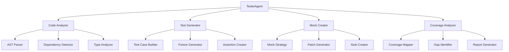

# 🧪 Tester Agent - Intelligent Unit Test Generation System

> **AI-Powered Test Generation with Comprehensive Coverage & Best Practices**  
> Generate production-ready unit tests with fixtures, mocks, and edge case handling.

[](https://www.python.org/downloads/)
[](https://langchain-ai.github.io/langgraph/)
[](https://azure.microsoft.com/en-us/products/ai-services/openai-service)
[](#)
[](https://docs.pytest.org/)

## 📋 Table of Contents

- [🎯 Overview](#-overview)
- [✨ Key Features](#-key-features)
- [🛠️ Available Tools](#️-available-tools)
- [🏗️ Architecture](#️-architecture)
- [🚀 Quick Start](#-quick-start)
- [💡 Usage Examples](#-usage-examples)
- [🔧 Configuration](#-configuration)
- [📊 Test Generation Strategies](#-test-generation-strategies)
- [🎨 Best Practices](#-best-practices)
- [🤝 Integration](#-integration)
- [📚 API Reference](#-api-reference)

---

## 🎯 Overview

The **TesterAgent** is a specialized AI agent that generates comprehensive, production-ready unit tests. It analyzes your code to create pytest-compatible test suites with proper fixtures, mocks, edge case handling, and follows testing best practices automatically.

### 🔥 Why TesterAgent?

| **Feature** | **Description** |
|---|---|
| 🎯 **Smart Test Generation** | Analyzes code structure to generate relevant tests |
| 🏗️ **Fixture Creation** | Automatically creates pytest fixtures and test data |
| 🎭 **Mock Generation** | Intelligent mocking of external dependencies |
| 🔍 **Edge Case Detection** | Identifies and tests boundary conditions |
| 📈 **Coverage Focus** | Aims for maximum code coverage |
| 📝 **Best Practices** | Follows pytest and Python testing conventions |

---

## ✨ Key Features

### 🎯 **Intelligent Test Generation**
- **Code Analysis**: Deep understanding of function signatures and logic
- **Test Strategy**: Generates tests for happy paths, edge cases, and error conditions
- **Assertion Selection**: Chooses appropriate assertions based on return types
- **Test Naming**: Clear, descriptive test names following conventions

### 🏗️ **Advanced Fixtures & Setup**
- **Fixture Generation**: Creates reusable test fixtures automatically
- **Parameterization**: Uses `pytest.mark.parametrize` for test variations
- **Setup/Teardown**: Proper test initialization and cleanup
- **Shared Resources**: Efficient resource management across tests

### 🎭 **Comprehensive Mocking**
- **Auto-Mock Detection**: Identifies external dependencies to mock
- **Mock Strategies**: Uses unittest.mock and pytest-mock effectively
- **Patch Decorators**: Proper use of @patch decorators
- **Side Effect Handling**: Simulates various scenarios with side_effect

### 📊 **Coverage Optimization**
- **Branch Coverage**: Tests all code paths and conditions
- **Exception Coverage**: Tests error handling and exceptions
- **Edge Cases**: Boundary values, empty inputs, None handling
- **Integration Points**: Tests interaction between components

### 🚀 **Modern Testing Features**
- **Async Support**: Generates tests for async/await code
- **Type Hints**: Respects and tests type annotations
- **Property Testing**: Can generate hypothesis-based tests
- **Performance Tests**: Optional performance regression tests

---

## 🛠️ Available Tools

### 1️⃣ **Core Test Generation Tools**
- `generate_unit_tests` - Generate comprehensive unit tests for functions and classes
- `generate_framework_tests` - Generate framework-specific tests (pytest, unittest)
- `generate_test_fixtures` - Create pytest fixtures and test data
- `generate_parameterized_tests` - Create data-driven tests with multiple test cases

### 2️⃣ **Advanced Testing Tools**
- `generate_integration_tests` - Generate tests for component interactions
- `generate_performance_tests` - Create performance and benchmark tests
- `analyze_test_coverage` - Analyze code coverage and suggest improvements

---

## 🏗️ Architecture



### 🏛️ **Core Components**

#### 1. **Code Analyzer**
Understands the code structure:
- AST parsing for deep code understanding
- Dependency graph construction
- Type information extraction
- Complexity analysis

#### 2. **Test Generator**
Creates comprehensive test suites:
- Test case generation for all scenarios
- Proper test structure and organization
- Assertion selection based on context
- Test data generation

#### 3. **Mock Creator**
Handles external dependencies:
- Intelligent mock object creation
- Patch placement optimization
- Side effect simulation
- Mock verification

#### 4. **Coverage Analyzer**
Ensures comprehensive testing:
- Coverage gap identification
- Branch coverage analysis
- Suggestion generation for untested code

---

## 🚀 Quick Start

### 1. **Installation**

```bash
# Clone the repository
git clone <repository-url>
cd workspace

# Install dependencies
pip install -r requirements.txt
```

### 2. **Basic Setup**

```python
from agent.tester import TesterAgent

# Create a Tester Agent
tester = TesterAgent()

# Generate tests for a simple function
result = tester.chat("""
Generate unit tests for this function:

def calculate_discount(price, discount_percent):
    if discount_percent < 0 or discount_percent > 100:
        raise ValueError("Discount must be between 0 and 100")
    
    discount_amount = price * (discount_percent / 100)
    final_price = price - discount_amount
    
    return {
        'original_price': price,
        'discount_amount': discount_amount,
        'final_price': final_price
    }
""")

print(result)  # Complete pytest test suite
```

### 3. **Generate Tests for Existing Code**

```python
# Generate tests for a module
result = tester.chat("""
Generate comprehensive unit tests for the user_service.py module.
Focus on the UserService class and ensure all methods are tested.
Include mocks for the database connections.
""")
```

---

## 💡 Usage Examples

### 🎯 **Example 1: Basic Function Testing**

```python
from agent.tester import TesterAgent

tester = TesterAgent()

# Generate tests for a utility function
response = tester.chat("""
Generate unit tests for this string manipulation function:

def format_phone_number(phone):
    '''Format phone number to (XXX) XXX-XXXX format'''
    # Remove all non-digit characters
    digits = ''.join(filter(str.isdigit, phone))
    
    if len(digits) != 10:
        raise ValueError("Phone number must have exactly 10 digits")
    
    return f"({digits[:3]}) {digits[3:6]}-{digits[6:]}"
""")

# TesterAgent will generate:
# - Tests for valid inputs
# - Tests for invalid inputs (too short, too long)
# - Tests with various formats as input
# - Edge cases (empty string, None, special characters)
```

### 🏗️ **Example 2: Class Testing with Fixtures**

```python
# Generate tests for a class with dependencies
response = tester.chat("""
Generate unit tests for this repository class:

class UserRepository:
    def __init__(self, db_connection):
        self.db = db_connection
    
    def get_user(self, user_id):
        query = "SELECT * FROM users WHERE id = ?"
        return self.db.execute(query, (user_id,)).fetchone()
    
    def create_user(self, username, email):
        query = "INSERT INTO users (username, email) VALUES (?, ?)"
        cursor = self.db.execute(query, (username, email))
        return cursor.lastrowid
    
    def update_user(self, user_id, **kwargs):
        fields = ', '.join(f"{k} = ?" for k in kwargs.keys())
        query = f"UPDATE users SET {fields} WHERE id = ?"
        values = list(kwargs.values()) + [user_id]
        self.db.execute(query, values)
        return self.db.commit()

Include fixtures for database mocking and test data.
""")

# TesterAgent will create:
# - Fixtures for mock database
# - Tests for each method
# - Mock return values and side effects
# - Error condition tests
```

### 🎭 **Example 3: Async Code Testing**

```python
# Generate tests for async code
response = tester.chat("""
Generate tests for this async API client:

import aiohttp
import asyncio

class WeatherAPIClient:
    def __init__(self, api_key):
        self.api_key = api_key
        self.base_url = "https://api.weather.com/v1"
    
    async def get_current_weather(self, city):
        async with aiohttp.ClientSession() as session:
            url = f"{self.base_url}/current"
            params = {"city": city, "key": self.api_key}
            
            async with session.get(url, params=params) as response:
                if response.status == 404:
                    raise ValueError(f"City '{city}' not found")
                response.raise_for_status()
                return await response.json()
    
    async def get_forecast(self, city, days=5):
        async with aiohttp.ClientSession() as session:
            url = f"{self.base_url}/forecast"
            params = {"city": city, "days": days, "key": self.api_key}
            
            async with session.get(url, params=params) as response:
                response.raise_for_status()
                return await response.json()

Generate async tests with mocked HTTP responses.
""")

# TesterAgent will generate:
# - Async test functions with pytest-asyncio
# - Mocked aiohttp responses
# - Tests for various HTTP status codes
# - Error handling tests
```

### 📊 **Example 4: Data-Driven Testing**

```python
# Generate parameterized tests
response = tester.chat("""
Generate parameterized tests for this validation function:

def validate_email(email):
    import re
    
    if not email:
        return False
    
    # Basic email regex pattern
    pattern = r'^[a-zA-Z0-9._%+-]+@[a-zA-Z0-9.-]+\.[a-zA-Z]{2,}$'
    
    if not re.match(pattern, email):
        return False
    
    # Additional checks
    if email.count('@') != 1:
        return False
    
    local, domain = email.split('@')
    if len(local) > 64 or len(domain) > 255:
        return False
    
    return True

Create comprehensive parameterized tests with various email formats.
""")

# TesterAgent will use pytest.mark.parametrize with:
# - Valid emails in different formats
# - Invalid emails (missing @, multiple @, etc.)
# - Edge cases (max length, special characters)
# - International domain names
```

### 🔍 **Example 5: Integration Testing**

```python
# Generate integration tests
response = tester.chat("""
Generate integration tests for this service layer:

class OrderService:
    def __init__(self, order_repo, inventory_service, payment_service):
        self.order_repo = order_repo
        self.inventory = inventory_service
        self.payment = payment_service
    
    def create_order(self, user_id, items):
        # Check inventory
        for item in items:
            if not self.inventory.check_availability(item['product_id'], item['quantity']):
                raise ValueError(f"Product {item['product_id']} not available")
        
        # Calculate total
        total = sum(item['price'] * item['quantity'] for item in items)
        
        # Process payment
        payment_result = self.payment.charge(user_id, total)
        if not payment_result['success']:
            raise PaymentError("Payment failed")
        
        # Create order
        order = self.order_repo.create(
            user_id=user_id,
            items=items,
            total=total,
            payment_id=payment_result['transaction_id']
        )
        
        # Update inventory
        for item in items:
            self.inventory.reduce_stock(item['product_id'], item['quantity'])
        
        return order

Generate tests that verify the integration between services.
""")
```

---

## 🔧 Configuration

### ⚙️ **TesterConfig Class**

```python
class TesterConfig:
    # Test Generation Settings
    DEFAULT_TEST_FRAMEWORK = "pytest"
    INCLUDE_ASYNC_TESTS = True
    GENERATE_FIXTURES = True
    GENERATE_MOCKS = True
    
    # Coverage Settings
    MIN_COVERAGE_TARGET = 80  # Minimum coverage percentage
    INCLUDE_BRANCH_COVERAGE = True
    
    # Test Style
    TEST_NAMING_CONVENTION = "test_{function_name}_{scenario}"
    USE_TYPE_HINTS = True
    INCLUDE_DOCSTRINGS = True
    
    # Mock Settings
    MOCK_LIBRARY = "unittest.mock"  # or "pytest-mock"
    AUTO_MOCK_EXTERNAL_DEPS = True
    
    # Edge Case Settings
    INCLUDE_EDGE_CASES = True
    INCLUDE_ERROR_CASES = True
    INCLUDE_PERFORMANCE_TESTS = False
```

### 🔐 **Environment Variables**

```bash
# Test generation preferences
export TESTER_FRAMEWORK="pytest"
export TESTER_COVERAGE_TARGET=85

# Style preferences
export TESTER_USE_TYPE_HINTS=true
export TESTER_NAMING_CONVENTION="test_{function}_{case}"

# Mock preferences
export TESTER_MOCK_LIBRARY="pytest-mock"
export TESTER_AUTO_MOCK=true
```

---

## 📊 Test Generation Strategies

### 🎯 **Coverage Strategies**

The TesterAgent employs multiple strategies to ensure comprehensive coverage:

1. **Statement Coverage**
   ```python
   # Ensures every line is executed
   - Tests for all function paths
   - Tests for all conditional branches
   - Tests for loop iterations
   ```

2. **Branch Coverage**
   ```python
   # Tests all decision points
   - If/else branches
   - Try/except blocks
   - Switch/case logic
   ```

3. **Edge Case Coverage**
   ```python
   # Boundary value testing
   - Empty collections
   - None/null values
   - Maximum/minimum values
   - Type boundaries
   ```

### 🏗️ **Test Structure Patterns**

#### AAA Pattern (Arrange-Act-Assert)
```python
def test_user_creation():
    # Arrange
    username = "testuser"
    email = "test@example.com"
    
    # Act
    user = create_user(username, email)
    
    # Assert
    assert user.username == username
    assert user.email == email
```

#### Given-When-Then Pattern
```python
def test_order_processing():
    # Given a valid order
    order = create_test_order()
    
    # When the order is processed
    result = process_order(order)
    
    # Then the order should be completed
    assert result.status == "completed"
```

---

## 🎨 Best Practices

### 💡 **Test Writing Guidelines**

1. **Clear Test Names**
   ```python
   # Good
   def test_calculate_discount_with_valid_percentage():
   
   # Bad
   def test_1():
   ```

2. **One Assertion Per Test (When Possible)**
   ```python
   # Good - focused test
   def test_user_email_validation():
       user = User(email="invalid-email")
       assert not user.is_valid()
   
   # Consider splitting complex assertions
   ```

3. **Use Fixtures for Repeated Setup**
   ```python
   @pytest.fixture
   def sample_user():
       return User(name="Test", email="test@example.com")
   
   def test_user_update(sample_user):
       sample_user.update(name="Updated")
       assert sample_user.name == "Updated"
   ```

### 🎭 **Mocking Best Practices**

1. **Mock at the Right Level**
   ```python
   # Good - mock external dependency
   @patch('requests.get')
   def test_api_call(mock_get):
       mock_get.return_value.json.return_value = {'status': 'ok'}
   
   # Avoid mocking internals unless necessary
   ```

2. **Verify Mock Interactions**
   ```python
   # Verify the mock was called correctly
   mock_service.process.assert_called_once_with(expected_data)
   ```

---

## 🤝 Integration

### 🔗 **With CoderAgent**

```python
from agent.coder import CoderAgent
from agent.tester import TesterAgent

# Generate code
coder = CoderAgent()
code = coder.generate_agent(
    template_type="simple",
    agent_name="DataProcessor",
    purpose="Process CSV files"
)

# Generate tests for the code
tester = TesterAgent()
tests = tester.chat(f"Generate comprehensive unit tests for this code:\n{code}")
```

### ⚙️ **With ExecutorAgent**

```python
from agent.tester import TesterAgent
from agent.executor import ExecutorAgent

# Generate tests
tester = TesterAgent()
tests = tester.chat("Generate tests for the auth module")

# Execute tests
executor = ExecutorAgent()
results = executor.chat(f"Run these tests and show coverage:\n{tests}")
```

### 🔄 **Complete Workflow**

```python
# 1. Generate code
code = coder.generate_agent(...)

# 2. Generate tests
tests = tester.chat(f"Generate tests for:\n{code}")

# 3. Execute tests
results = executor.chat(f"Run tests:\n{tests}")

# 4. Improve based on coverage
if results['coverage'] < 80:
    more_tests = tester.chat(
        f"Improve test coverage for uncovered lines:\n{results['uncovered']}"
    )
```

---

## 📚 API Reference

### 🏗️ **TesterAgent**

#### Constructor
```python
TesterAgent(
    session_id: str = None,
    use_all_tools: bool = False,
    config: TesterConfig = None
)
```
- `session_id`: Unique session identifier
- `use_all_tools`: Enable all available tools
- `config`: Custom configuration

#### Methods

##### `generate_tests()`
```python
def generate_tests(
    code: str,
    test_type: str = "unit",
    coverage_target: int = 80,
    include_mocks: bool = True
) -> TestSuite
```

**Returns:**
```python
{
    "tests": str,  # Generated test code
    "fixtures": str,  # Generated fixtures
    "coverage_estimate": int,  # Estimated coverage
    "test_count": int,  # Number of tests
    "mocks_used": List[str]  # List of mocked dependencies
}
```

##### `chat()`
```python
def chat(message: str) -> str
```
Interactive interface for test generation requests.

### 🛠️ **Available Tools Reference**

| Tool | Purpose | Key Features |
|------|---------|--------------|
| `generate_unit_tests` | Create unit tests | Full test suite, edge cases, mocking |
| `generate_framework_tests` | Framework-specific tests | pytest/unittest compatibility |
| `generate_test_fixtures` | Generate fixtures | Reusable test data, setup/teardown |
| `generate_parameterized_tests` | Data-driven tests | Multiple test cases, pytest.mark.parametrize |
| `generate_integration_tests` | Integration testing | Component interaction, service mocking |
| `generate_performance_tests` | Performance tests | Benchmarks, timing, profiling |
| `analyze_test_coverage` | Coverage analysis | Gap identification, improvement suggestions |

---

## 🚀 Advanced Features

### 🧬 **Property-Based Testing**

Generate hypothesis-based tests:

```python
response = tester.chat("""
Generate property-based tests using hypothesis for this function:

def sort_numbers(numbers: List[int]) -> List[int]:
    return sorted(numbers)
""")

# Generates tests with hypothesis strategies
```

### 🎭 **Mutation Testing Support**

Test the tests themselves:

```python
response = tester.chat("""
Generate tests that would catch mutations in this function:

def calculate_average(numbers):
    if not numbers:
        return 0
    return sum(numbers) / len(numbers)

Ensure tests would fail if operators are changed.
""")
```

### 📸 **Snapshot Testing**

For complex outputs:

```python
response = tester.chat("""
Generate snapshot tests for this report generator:

def generate_report(data):
    # Complex report generation logic
    return report_dict

Use pytest-snapshot for output validation.
""")
```

---

## 🤝 Contributing

### 🛠️ **Adding New Test Strategies**

1. Create strategy in `strategies.py`:
   ```python
   class MyTestStrategy:
       def generate_tests(self, code_ast):
           # Strategy implementation
           return generated_tests
   ```

2. Register with TesterAgent
3. Update documentation

### 📝 **Development Guidelines**

- Follow pytest best practices
- Ensure generated tests are readable
- Include helpful test descriptions
- Consider test maintenance

---

## 📄 License

This project is part of the Core Agent framework. See the main repository for licensing information.

---

**🧪 Ready to generate comprehensive test suites? Get started with the Quick Start guide above!**

*TesterAgent - Where AI Meets Test-Driven Development* 🎯