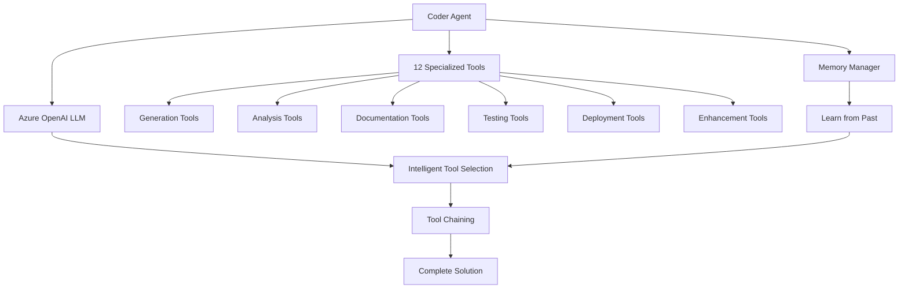

# 🚀 Coder Agent - Advanced AI Agent Generator with Comprehensive Toolkit

> **AI-Powered Agent Development System**  
> Transform your ideas into production-ready LangGraph agents with a complete development toolkit.

[](https://www.python.org/downloads/)
[](https://langchain-ai.github.io/langgraph/)
[](https://azure.microsoft.com/en-us/products/ai-services/openai-service)
[](#)

## 📋 Table of Contents

- [🎯 Overview](#-overview)
- [✨ Key Features](#-key-features)
- [🛠️ Available Tools](#️-available-tools)
- [🏗️ Architecture](#️-architecture)
- [🚀 Quick Start](#-quick-start)
- [💡 Usage Examples](#-usage-examples)
- [🔧 Configuration](#-configuration)
- [📚 API Reference](#-api-reference)
- [🤝 Contributing](#-contributing)

---

## 🎯 Overview

The **Coder Agent** is an advanced AI-powered system that handles the complete agent development lifecycle. Equipped with 12 specialized tools, it can generate, analyze, optimize, test, document, and deploy LangGraph agents - all through intelligent tool selection and chaining.

### 🔥 Why Coder Agent?

| **Feature** | **Description** |
|---|---|
| 🧠 **12 Specialized Tools** | Complete toolkit for agent development |
| 🔗 **Intelligent Tool Chaining** | LLM automatically chains tools for complex workflows |
| 🎯 **Dual Mode Generation** | Supports both standalone LangGraph and Core Agent based implementations |
| 📊 **Full Lifecycle Support** | From generation to deployment in one agent |
| 🧪 **Built-in Validation** | Automatically validates and optimizes generated code |
| 📝 **Auto Documentation** | Generates tests, docs, and deployment configs |

---

## ✨ Key Features

### 🧠 **Intelligent Code Generation**
- **Flexible Generation**: Create standalone LangGraph or Core Agent based implementations
- **Context-Aware**: Understands requirements and generates appropriate solutions
- **Production-Ready**: Creates complete, executable agents with error handling

### 🎨 **Multiple Agent Types**
- **Simple Agents**: Basic LangGraph workflows with state management
- **Tool-Enabled Agents**: Agents with custom tool integration and tool nodes
- **Multi-Agent Systems**: Supervisor-based systems with specialized worker agents

### 🔧 **Complete Development Toolkit**
- **Analysis & Optimization**: Analyze, validate, and optimize existing code
- **Testing & Documentation**: Auto-generate tests and comprehensive docs
- **Deployment Ready**: Create Docker configs, API wrappers, and more

### 📊 **Advanced Features**
- **Memory Integration**: Learns from past generations
- **Tool Intelligence**: LLM selects and chains appropriate tools
- **Session Management**: Unique session tracking for agent instances
- **Error Recovery**: Comprehensive error management

---

## 🛠️ Available Tools

### 1️⃣ **Generation Tools**
- `agent_generator` - Generate LangGraph agents based on specifications
- `generate_rag_agent` - Create RAG agents with vector stores

### 2️⃣ **Analysis Tools**
- `analyze_agent_code` - Analyze code and provide improvements
- `validate_agent` - Validate if code will run without errors
- `optimize_agent` - Optimize for performance and best practices

### 3️⃣ **Documentation Tools**
- `generate_agent_docs` - Create comprehensive documentation

### 4️⃣ **Testing Tools**
- `generate_unit_tests` - Generate test suites with pytest

### 5️⃣ **Deployment Tools**
- `dockerize_agent` - Create Docker configurations
- `convert_to_api` - Convert to FastAPI/Flask APIs

### 6️⃣ **Enhancement Tools**
- `add_monitoring` - Add Prometheus/Grafana monitoring
- `format_code` - Format with Black/isort standards

### 7️⃣ **Template Tools**
- `save_agent_template` - Save successful agents as templates

---

## 🏗️ Architecture



### 🏛️ **Core Components**

#### 1. **CoderAgent**
The main orchestrator that coordinates all development activities:
- Tool management (12 tools)
- LLM integration with tool awareness
- Memory integration
- Session management

#### 2. **Comprehensive Tool Suite**
Each tool is specialized for specific tasks:
- Input validation with Pydantic schemas
- Intelligent prompting for quality output
- Error handling and recovery

#### 3. **Intelligent Tool Selection**
The LLM intelligently:
- Selects appropriate tools for the task
- Chains tools for complex workflows
- Validates outputs before returning

---

## 🚀 Quick Start

### 1. **Installation**

```bash
# Clone the repository
git clone <repository-url>
cd workspace

# Install dependencies
pip install -r requirements.txt
```

### 2. **Basic Setup**

```python
from core_agents.coder import CoderAgent

# Create a Coder Agent (with all 12 tools ready)
agent = CoderAgent(session_id="my_session")

# Generate a simple agent
result = agent.generate_agent(
    template_type="simple",
    agent_name="DataProcessor", 
    purpose="Process and analyze data",
    use_our_core=False  # Standalone LangGraph
)

print(result["code"])
```

### 3. **Configuration**

```python
from core_agents.coder import CoderConfig

# Configure Azure OpenAI settings
CoderConfig.AZURE_OPENAI_ENDPOINT = "https://your-endpoint.openai.azure.com/"
CoderConfig.OPENAI_API_KEY = "your-api-key"
CoderConfig.GPT4_MODEL_NAME = "gpt-4"
```

---

## 💡 Usage Examples

### 🎯 **Example 1: Simple Standalone Agent**

```python
from core_agents.coder import CoderAgent

# Initialize with all tools
coder = CoderAgent()

# Generate a standalone LangGraph agent
result = coder.generate_agent(
    template_type="simple",
    agent_name="DataAnalyzer",
    purpose="Analyze CSV files and generate reports",
    use_our_core=False  # Pure LangGraph
)

print(f"✅ Generated: {result['agent_name']}")
print(f"📊 Type: Standalone LangGraph")
```

### 🛠️ **Example 2: Core Agent with Tools**

```python
# Generate using Core Agent infrastructure
result = coder.generate_agent(
    template_type="with_tools",
    agent_name="ResearchBot",
    purpose="Research topics using multiple sources",
    tools_needed=["web_search", "arxiv", "wikipedia"],
    use_our_core=True  # Use Core Agent
)

print(f"✅ Generated: {result['agent_name']} with Core Agent")
print(f"🔧 Tools: {result['tools']}")
```

### 🏢 **Example 3: Complete Development Workflow**

```python
# Let the LLM handle the complete workflow
response = coder.chat(
    "Create a customer support agent that processes tickets, "
    "analyzes sentiment, and routes to appropriate departments. "
    "Validate it, optimize for performance, add tests, and dockerize it."
)

# The Coder Agent will automatically:
# 1. Use agent_generator to create the agent
# 2. Use validate_agent to ensure it works
# 3. Use optimize_agent for performance
# 4. Use generate_unit_tests for testing
# 5. Use dockerize_agent for deployment
```

### 🎭 **Example 4: Analyze and Improve Existing Code**

```python
# Analyze existing agent code
existing_code = """
# Your existing agent code here
...
"""

response = coder.chat(f"""
Analyze this agent code and improve it:

```python
{existing_code}
```

Focus on performance, error handling, and best practices.
""")

# The agent will use analyze_agent_code, optimize_agent, 
# and potentially format_code tools
```

### 🚀 **Example 5: RAG Agent Generation**

```python
# Generate a RAG agent with vector store
response = coder.chat(
    "Create a RAG agent for our documentation that can answer "
    "technical questions using our knowledge base"
)

# Uses generate_rag_agent tool for specialized RAG implementation
```

---

## 🔧 Configuration

### ⚙️ **CoderConfig Class**

```python
class CoderConfig:
    # Azure OpenAI Configuration
    AZURE_OPENAI_ENDPOINT = "https://your-endpoint.openai.azure.com/"
    OPENAI_API_KEY = "your-api-key"
    OPENAI_API_VERSION = "2023-12-01-preview"
    
    # Model Configuration
    GPT4_MODEL_NAME = "gpt-4"
    GPT4_DEPLOYMENT_NAME = "gpt4"
    
    # Generation Parameters
    TEMPERATURE = 0.1  # Low for consistent code
    MAX_TOKENS = 4000  # Sufficient for most agents
```

### 🔐 **Environment Variables**

```bash
export AZURE_OPENAI_ENDPOINT="https://your-endpoint.openai.azure.com/"
export OPENAI_API_KEY="your-api-key"
export OPENAI_API_VERSION="2023-12-01-preview"
```

---

## 📚 API Reference

### 🏗️ **CoderAgent**

#### Constructor
```python
CoderAgent(session_id: str = None)
```
- `session_id`: Unique identifier for the session (auto-generated if not provided)
- Initializes with all 12 tools available

#### Methods

##### `generate_agent()`
```python
def generate_agent(
    template_type: str,
    agent_name: str, 
    purpose: str,
    tools_needed: List[str] = None,
    use_our_core: bool = False
) -> Dict[str, Any]
```

**Parameters:**
- `template_type`: `"simple"`, `"with_tools"`, or `"multi_agent"`
- `agent_name`: Name for the generated agent
- `purpose`: Description of what the agent should do
- `tools_needed`: List of tools for tool-enabled agents
- `use_our_core`: Whether to use Core Agent infrastructure (default: False)

**Returns:**
```python
{
    "success": bool,
    "agent_name": str,
    "template_type": str,
    "purpose": str,
    "tools": List[str],
    "code": str,
    "error": str  # If success is False
}
```

##### `chat()`
```python
def chat(message: str) -> str
```
Interactive interface that intelligently uses available tools.

### 🛠️ **Available Tools Reference**

Each tool has its own schema and capabilities:

| Tool | Purpose | Key Features |
|------|---------|--------------|
| `agent_generator` | Generate agents | Standalone/Core Agent modes |
| `analyze_agent_code` | Code analysis | Improvements, best practices |
| `validate_agent` | Validation | Syntax, imports, logic checks |
| `optimize_agent` | Optimization | Performance, memory, patterns |
| `generate_agent_docs` | Documentation | README, API docs, guides |
| `generate_unit_tests` | Testing | pytest, fixtures, coverage |
| `dockerize_agent` | Containerization | Dockerfile, compose, configs |
| `convert_to_api` | API wrapper | FastAPI/Flask conversion |
| `add_monitoring` | Observability | Metrics, dashboards, alerts |
| `generate_rag_agent` | RAG agents | Vector stores, retrieval |
| `format_code` | Code formatting | Black, isort, cleanup |
| `save_agent_template` | Templates | Reusable patterns |

---

## 🎯 Best Practices

### 💡 **Tool Usage**

1. **Let the LLM Decide**
   ```python
   # Good - let the agent choose tools
   response = coder.chat("Create and optimize an email processing agent")
   
   # The LLM will automatically use appropriate tools
   ```

2. **Be Specific for Better Results**
   ```python
   # Good - specific requirements
   response = coder.chat(
       "Create a sentiment analysis agent with async support, "
       "comprehensive error handling, and Redis caching"
   )
   ```

3. **Chain Operations Naturally**
   ```python
   # Good - natural workflow description
   response = coder.chat(
       "Create a data pipeline agent, validate it works correctly, "
       "optimize for processing 1M records/hour, then dockerize it"
   )
   ```

### 🔧 **Code Generation**

1. **Choose the Right Mode**
   ```python
   # Standalone for simple, self-contained agents
   use_our_core=False
   
   # Core Agent for complex features (memory, advanced tools)
   use_our_core=True
   ```

2. **Provide Clear Purpose**
   ```python
   # Good
   purpose = "Monitor social media for brand mentions, analyze sentiment, and alert on negative trends"
   
   # Too vague
   purpose = "Monitor social media"
   ```

---

## 🚀 Advanced Features

### 🔗 **Tool Chaining**

The Coder Agent can intelligently chain tools:

```python
# Single request triggers multiple tools
response = coder.chat(
    "Create a web scraping agent, ensure it handles rate limiting, "
    "add monitoring for success rates, and create a Docker deployment"
)

# Automatically uses:
# 1. agent_generator → Create the agent
# 2. analyze_agent_code → Check for rate limiting
# 3. add_monitoring → Add metrics
# 4. dockerize_agent → Create deployment
```

### 🧠 **Learning from History**

With memory enabled, the agent learns from past generations:

```python
# First generation
coder.generate_agent(template_type="simple", agent_name="DataProcessor", ...)

# Later generation benefits from learned patterns
coder.generate_agent(template_type="simple", agent_name="LogProcessor", ...)
# May reuse successful patterns from DataProcessor
```

### 🎯 **Smart Tool Selection**

The agent intelligently selects tools based on keywords:

```python
# "validate" → triggers validate_agent tool
# "optimize" → triggers optimize_agent tool  
# "deploy" → triggers dockerize_agent tool
# "test" → triggers generate_unit_tests tool
```

---

## 🤝 Contributing

### 🛠️ **Adding New Tools**

1. Create tool in `core_agents/tools.py`:
   ```python
   def create_my_new_tool(model):
       class MyNewTool(BaseTool):
           name = "my_new_tool"
           description = "What this tool does"
           # Implementation
       return MyNewTool()
   ```

2. Add to `create_all_coder_tools()` function

3. Update documentation

### 📝 **Development Guidelines**

- Follow existing tool patterns
- Add comprehensive docstrings
- Include error handling
- Write tests for new features

---

## 📄 License

This project is part of the Core Agent framework. See the main repository for licensing information.

---

**🚀 Ready to revolutionize your agent development? Get started with the Quick Start guide above!**

*Coder Agent - Where AI Meets Complete Agent Development* ✨