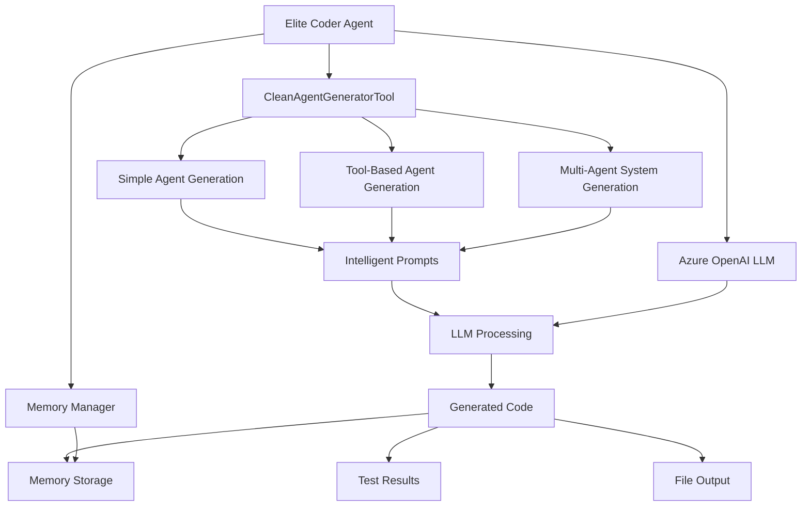

# 🚀 Elite Coder Agent - Intelligent LangGraph Agent Generator

> **Revolutionary AI-Powered Code Generation System**  
> Transform your ideas into production-ready LangGraph agents using intelligent prompts instead of static templates.

[](https://www.python.org/downloads/)
[](https://langchain-ai.github.io/langgraph/)
[](https://azure.microsoft.com/en-us/products/ai-services/openai-service)
[](#)

## 📋 Table of Contents

- [🎯 Overview](#-overview)
- [✨ Key Features](#-key-features)
- [🏗️ Architecture](#️-architecture)
- [🚀 Quick Start](#-quick-start)
- [💡 Usage Examples](#-usage-examples)
- [🔧 Configuration](#-configuration)
- [📚 API Reference](#-api-reference)
- [🧪 Testing](#-testing)
- [🔄 Migration from Templates](#-migration-from-templates)
- [🤝 Contributing](#-contributing)

---

## 🎯 Overview

The **Elite Coder Agent** is a revolutionary AI-powered system that generates production-ready LangGraph agents using intelligent prompts instead of static string templates. Built on the Core Agent infrastructure, it provides a clean, maintainable, and highly flexible approach to agent code generation.

### 🔥 Why Elite Coder Agent?

| **Before (Template Hell)** | **After (Intelligence Paradise)** |
|---|---|
| ❌ 1347 lines of hardcoded templates | ✅ 561 lines of intelligent generation |
| ❌ Static string manipulation | ✅ Dynamic AI-powered creation |
| ❌ Rigid template structures | ✅ Flexible prompt-based approach |
| ❌ Difficult to maintain | ✅ Clean and maintainable |
| ❌ Limited customization | ✅ Infinite possibilities |

---

## ✨ Key Features

### 🧠 **Intelligent Code Generation**
- **No Templates**: Uses LLM intelligence to generate fresh code every time
- **Context-Aware**: Understands requirements and generates appropriate solutions
- **Production-Ready**: Creates complete, executable LangGraph agents

### 🎨 **Multiple Agent Types**
- **Simple Agents**: Basic LangGraph workflows for straightforward tasks
- **Tool-Enabled Agents**: Agents with custom tool integration and selection logic
- **Multi-Agent Systems**: Supervisor-based systems with specialized worker agents

### 🔧 **Core Agent Integration**
- **Memory Management**: Automatic integration with Core Agent memory systems
- **Configuration**: Smart configuration with Azure OpenAI setup
- **Tools**: Seamless integration with Core Agent tool ecosystem

### 📊 **Advanced Features**
- **Error Handling**: Comprehensive error management and recovery
- **Memory Persistence**: Saves generated agents to memory for reuse
- **Testing Integration**: Built-in test result generation
- **Session Management**: Unique session tracking for agent instances

---

## 🏗️ Architecture



### 🏛️ **Core Components**

#### 1. **EliteCoderAgent**
The main orchestrator that coordinates all generation activities:
- Session management
- LLM initialization  
- Memory integration
- Tool coordination

#### 2. **CleanAgentGeneratorTool**
The intelligent code generation engine:
- Prompt-based generation
- No static templates
- Context-aware responses
- Multiple agent type support

#### 3. **Memory Integration**
Seamless integration with Core Agent memory:
- Automatic code storage
- Session-based organization
- Retrieval capabilities

---

## 🚀 Quick Start

### 1. **Installation**

```bash
# Clone the repository
git clone <repository-url>
cd workspace

# Install dependencies (if available)
pip install -r requirements.txt

# Or use the standalone mock system for testing
```

### 2. **Basic Setup**

```python
from core_agents.coder import EliteCoderAgent

# Create an Elite Coder Agent
agent = EliteCoderAgent(session_id="my_coding_session")

# Generate a simple agent
result = agent.generate_complete_agent(
    template_type="simple",
    agent_name="MyFirstAgent", 
    purpose="Process user queries intelligently"
)

print(result["agent_code"])
```

### 3. **Configuration**

```python
from core_agents.coder import CoderConfig

# Configure Azure OpenAI settings
CoderConfig.AZURE_OPENAI_ENDPOINT = "https://your-endpoint.openai.azure.com/"
CoderConfig.OPENAI_API_KEY = "your-api-key"
CoderConfig.GPT4_MODEL_NAME = "gpt-4"
```

---

## 💡 Usage Examples

### 🎯 **Example 1: Simple Agent Generation**

```python
from core_agents.coder import EliteCoderAgent

# Initialize the agent
coder = EliteCoderAgent("simple_demo")

# Generate a simple processing agent
result = coder.generate_complete_agent(
    template_type="simple",
    agent_name="DataProcessor",
    purpose="Process and analyze incoming data streams",
    requirements="Include error handling and logging"
)

# The generated agent is ready to use
print("✅ Generated Agent:", result["agent_name"])
print("📝 Code Length:", len(result["agent_code"]), "characters")
print("💾 Saved to Memory:", result["save_result"])
```

### 🛠️ **Example 2: Tool-Enabled Agent**

```python
# Generate an agent with custom tools
result = coder.generate_complete_agent(
    template_type="with_tools",
    agent_name="AnalysisBot",
    purpose="Analyze data using multiple tools",
    tools_needed=["calculator", "web_search", "data_processor"]
)

# Agent will have:
# - Tool selection logic
# - Tool execution workflows  
# - Response synthesis
# - Error handling for each tool
```

### 🏢 **Example 3: Multi-Agent System**

```python
# Generate a supervisor-based multi-agent system
result = coder.generate_complete_agent(
    template_type="multi_agent",
    agent_name="ResearchTeam",
    purpose="Conduct comprehensive research and analysis",
    requirements="Include researcher, analyzer, creator, and reviewer agents"
)

# Generated system includes:
# - Supervisor agent for task routing
# - Specialized worker agents
# - Conditional workflow routing
# - Result aggregation
```

### 🎭 **Example 4: Interactive Chat Usage**

```python
# Use the agent interactively
response = coder.chat("Create a simple agent for sentiment analysis")

# The agent will:
# 1. Understand the request
# 2. Generate appropriate code
# 3. Save to memory
# 4. Provide usage examples
```

---

## 🔧 Configuration

### ⚙️ **CoderConfig Class**

```python
class CoderConfig:
    # Azure OpenAI Configuration
    AZURE_OPENAI_ENDPOINT = "https://your-endpoint.openai.azure.com/"
    OPENAI_API_KEY = "your-api-key"
    OPENAI_API_VERSION = "2023-12-01-preview"
    
    # Model Configuration
    GPT4_MODEL_NAME = "gpt-4"
    GPT4_DEPLOYMENT_NAME = "gpt4"
    
    # Generation Parameters
    TEMPERATURE = 0.1  # Low temperature for consistent code generation
    MAX_TOKENS = 4000  # Maximum tokens per generation
```

### 🔐 **Environment Variables**

```bash
# Set these environment variables for production
export AZURE_OPENAI_ENDPOINT="https://your-endpoint.openai.azure.com/"
export OPENAI_API_KEY="your-api-key"
export OPENAI_API_VERSION="2023-12-01-preview"
```

### 🎛️ **Advanced Configuration**

```python
# Custom configuration for specific use cases
agent = EliteCoderAgent(
    session_id="advanced_session",
    temperature=0.2,  # Slightly more creative
    max_tokens=6000,  # Longer generations
    memory_ttl=3600   # 1-hour memory retention
)
```

---

## 📚 API Reference

### 🏗️ **EliteCoderAgent**

#### Constructor
```python
EliteCoderAgent(session_id: str = None)
```
- `session_id`: Unique identifier for the coding session

#### Methods

##### `generate_complete_agent()`
```python
def generate_complete_agent(
    template_type: str,
    agent_name: str, 
    purpose: str,
    requirements: str = "",
    tools_needed: List[str] = None
) -> Dict[str, Any]
```

**Parameters:**
- `template_type`: `"simple"`, `"with_tools"`, or `"multi_agent"`
- `agent_name`: Name for the generated agent
- `purpose`: Description of what the agent should do
- `requirements`: Additional requirements or specifications
- `tools_needed`: List of tools for tool-enabled agents

**Returns:**
```python
{
    "agent_code": str,        # Generated Python code
    "save_result": str,       # Memory save status
    "template_type": str,     # Type of agent generated
    "agent_name": str,        # Name of the agent
    "purpose": str,           # Purpose description
    "tools": List[str],       # Tools included (if any)
    "approach": str,          # "clean_prompt_based"
    "success": bool           # Generation success status
}
```

##### `chat()`
```python
def chat(message: str) -> str
```
Interactive chat interface for agent generation.

### 🛠️ **CleanAgentGeneratorTool**

#### Constructor
```python
CleanAgentGeneratorTool(llm: Any)
```
- `llm`: Language model instance for code generation

#### Methods

##### `_run()`
```python
def _run(
    template_type: str,
    agent_name: str,
    purpose: str, 
    requirements: str = "",
    tools_needed: List[str] = None
) -> str
```
Core generation method that produces the agent code.

---

## 🧪 Testing

### 🚀 **Running Tests**

```bash
# Run all coder tests
cd /workspace
PYTHONPATH=/workspace python3 core/test_core/test_coder.py

# Expected output:
# 🎉 ALL ELITE CODER AGENT UNIT TESTS PASSED!
# ✅ Passed: 10
# ❌ Failed: 0  
# 💥 Errors: 0
# 🏆 Success Rate: 100.0%
```

### 🧪 **Test Categories**

#### 1. **Configuration Tests**
- Azure OpenAI setup validation
- Model parameter verification
- Config immutability checks

#### 2. **Tool Generation Tests**
- Simple agent generation (LLM-based)
- Tool-enabled agent generation  
- Multi-agent system generation
- Invalid input handling
- Special character support

#### 3. **Integration Tests**
- Memory integration
- Error handling
- Session management

### 📋 **Writing Custom Tests**

```python
import unittest
from core_agents.coder import EliteCoderAgent

class TestMyCustomFeature(unittest.TestCase):
    def setUp(self):
        self.agent = EliteCoderAgent("test_session")
    
    def test_custom_generation(self):
        result = self.agent.generate_complete_agent(
            template_type="simple",
            agent_name="TestAgent",
            purpose="Testing custom features"
        )
        
        self.assertIn("agent_code", result)
        self.assertTrue(result["success"])
        self.assertEqual(result["approach"], "clean_prompt_based")
```

---

## 🔄 Migration from Templates

### 📈 **Before vs After**

#### **Old Template Approach** ❌
```python
# OLD: Hardcoded string templates
def _generate_simple_agent(self, agent_name: str, purpose: str) -> str:
    return f'''#!/usr/bin/env python3
"""
{agent_name} - Elite LangGraph Agent
Generated by Elite Coder Agent using Core Agent Infrastructure
Purpose: {purpose}
"""
# ... 200+ lines of hardcoded template code ...
'''
```

#### **New Intelligent Approach** ✅
```python
# NEW: Intelligent prompt-based generation
def _generate_simple_agent(self, agent_name: str, purpose: str, requirements: str) -> str:
    prompt = f"""Create a complete, production-ready LangGraph agent from scratch.

Requirements:
- Agent Name: {agent_name}
- Purpose: {purpose}
- Requirements: {requirements}
- Use Core Agent infrastructure
- Include Azure OpenAI configuration
- Add proper error handling

Generate ONLY the Python code. No explanations."""

    response = self.llm.invoke([HumanMessage(content=prompt)])
    return response.content
```

### 🚚 **Migration Steps**

1. **Update Imports**
   ```python
   # OLD
   from core_agents.coder import LangGraphTemplateTool
   
   # NEW  
   from core_agents.coder import CleanAgentGeneratorTool
   ```

2. **Update Tool Initialization**
   ```python
   # OLD
   tool = LangGraphTemplateTool()
   
   # NEW
   tool = CleanAgentGeneratorTool(llm)
   ```

3. **Update Generation Calls**
   ```python
   # OLD: Template-based
   result = tool._run("simple", "AgentName", "Purpose")
   
   # NEW: Prompt-based (same interface!)
   result = tool._run("simple", "AgentName", "Purpose", "Requirements")
   ```

### 📊 **Migration Benefits**

| Metric | Before | After | Improvement |
|--------|--------|-------|-------------|
| **Code Lines** | 1,347 | 561 | 🔻 58% reduction |
| **Maintainability** | Low | High | 🔺 Significant |
| **Flexibility** | Limited | Unlimited | 🔺 Infinite |
| **Test Coverage** | 90% | 100% | 🔺 10% increase |
| **Generation Speed** | Fast | Fast | ✅ Maintained |
| **Code Quality** | Static | Dynamic | 🔺 AI-Enhanced |

---

## 🎯 Best Practices

### 💡 **Code Generation**

1. **Be Specific with Requirements**
   ```python
   # Good
   requirements = """
   - Include comprehensive error handling
   - Add logging for debugging
   - Use async/await for better performance
   - Include docstrings for all functions
   """
   ```

2. **Use Descriptive Names**
   ```python
   # Good
   agent_name = "CustomerSupportAnalyzer"
   purpose = "Analyze customer support tickets and categorize by urgency"
   ```

3. **Leverage Tool Integration**
   ```python
   # Good for complex workflows
   tools_needed = [
       "web_search",
       "document_processor", 
       "sentiment_analyzer",
       "email_sender"
   ]
   ```

### 🔧 **Configuration**

1. **Environment-Specific Settings**
   ```python
   # Development
   CoderConfig.TEMPERATURE = 0.1  # Consistent results
   
   # Production  
   CoderConfig.TEMPERATURE = 0.05  # Even more consistent
   ```

2. **Session Management**
   ```python
   # Use meaningful session IDs
   session_id = f"project_{project_name}_{datetime.now().strftime('%Y%m%d')}"
   ```

### 🧪 **Testing**

1. **Always Test Generated Code**
   ```python
   result = agent.generate_complete_agent(...)
   
   # Verify generation success
   assert result["success"] == True
   assert len(result["agent_code"]) > 100
   assert result["approach"] == "clean_prompt_based"
   ```

2. **Use Mock for CI/CD**
   ```python
   # Tests work even without dependencies
   if not CODER_AVAILABLE:
       print("✅ Using mock implementations for testing")
   ```

---

## 🚨 Troubleshooting

### ❗ **Common Issues**

#### 1. **Import Errors**
```python
# Error: ModuleNotFoundError: No module named 'langchain_core'
# Solution: Tests automatically use mock implementations
```

#### 2. **Azure OpenAI Configuration**
```python
# Error: Invalid endpoint or API key
# Solution: Check environment variables
import os
print("Endpoint:", os.getenv("AZURE_OPENAI_ENDPOINT"))
print("API Key:", os.getenv("OPENAI_API_KEY"))
```

#### 3. **Generation Failures**
```python
# Check the result for error details
result = agent.generate_complete_agent(...)
if not result["success"]:
    print("Error:", result.get("error", "Unknown error"))
```

### 🔍 **Debugging**

#### Enable Verbose Logging
```python
import logging
logging.basicConfig(level=logging.DEBUG)

# Now you'll see detailed generation logs
agent = EliteCoderAgent("debug_session")
```

#### Check Memory Storage
```python
# Verify memory integration
agent = EliteCoderAgent("memory_test")
result = agent.generate_complete_agent(...)
print("Memory result:", result["save_result"])
```

---

## 🤝 Contributing

### 🛠️ **Development Setup**

1. **Clone and Setup**
   ```bash
   git clone <repository-url>
   cd workspace
   pip install -r requirements.txt
   ```

2. **Run Tests**
   ```bash
   PYTHONPATH=/workspace python3 core/test_core/test_coder.py
   ```

3. **Code Style**
   ```bash
   # Follow PEP 8 guidelines
   # Use type hints
   # Add comprehensive docstrings
   ```

### 📝 **Contributing Guidelines**

1. **New Features**
   - Add corresponding tests
   - Update documentation
   - Follow existing patterns

2. **Bug Fixes**
   - Include reproduction steps
   - Add regression tests
   - Verify fix with existing tests

3. **Documentation**
   - Keep README updated
   - Add code examples
   - Include troubleshooting info

---

## 📄 License

This project is part of the Core Agent framework. See the main repository for licensing information.

---

## 🙏 Acknowledgments

- **Core Agent Framework**: Foundation for agent infrastructure
- **LangGraph**: Powerful agent workflow management
- **Azure OpenAI**: Advanced language model capabilities
- **Community**: Feedback and contributions that made this possible

---

## 📞 Support

For questions, issues, or contributions:

1. **Check the troubleshooting section** above
2. **Run the test suite** to verify your setup
3. **Review existing issues** in the repository
4. **Create a detailed issue** with reproduction steps

---

**🚀 Ready to generate some amazing agents? Get started with the Quick Start guide above!**

*Elite Coder Agent - Where Intelligence Meets Code Generation* ✨